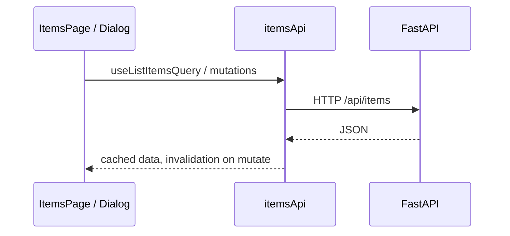

# Items — architecture (frontend)

## Stack

- **React 19 + TypeScript** (Vite)
- **shadcn/ui** (Radix primitives + Tailwind CSS v4)
- **Redux Toolkit**: RTK Query for server state, slice for UI dialog state

## Structure

| Area | Path | Role |
|------|------|------|
| Page | `src/features/items/ItemsPage.tsx` | List, actions, empty/error states |
| Dialog | `src/features/items/ItemFormDialog.tsx` | Create/edit form |
| API | `src/store/api/itemsApi.ts` | CRUD endpoints, cache tags |
| UI state | `src/store/slices/appSlice.ts` | Dialog mode + editing id |
| Types | `src/types/item.ts` | Shared Item shapes |
| Config | `src/lib/config.ts` | `VITE_API_BASE_URL` default |

## Data flow

## RTK Query

- `listItems` provides tags per id and `LIST`.
- Mutations invalidate `LIST` and affected ids so the grid stays in sync.

## Global UI state

- `appSlice` holds `itemDialogMode` (`create` | `edit` | null) and `editingItemId`.
- Keeps form dialog decoupled from route-level routing (single-page CRUD).

## Styling

- Tailwind via `@tailwindcss/vite`; shadcn theme variables in `src/index.css`.
- `components.json` documents shadcn paths for adding more UI primitives.
