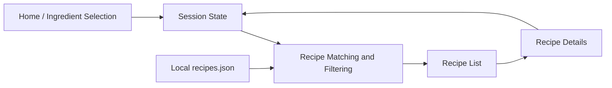

# Recipe Generator - Application Architecture

## Overview

The feature is documented as one end-to-end vertical slice. The frontend owns page presentation and session state; the local recipe dataset and matching logic provide deterministic results without an external API.



## Application Areas

| Area | Responsibility | Suggested location |
|------|----------------|--------------------|
| Pages | Render Home, Recipe List, and Recipe Details views | `frontend/src/features/recipe-generator/` |
| Session state | Store selected ingredients, active filters, and selected recipe id | `frontend/src/store/` or feature state |
| Dataset | Store the curated recipes and predefined ingredient catalog | `frontend/src/data/` or an equivalent local data folder |
| Matching | Normalize ingredients, calculate match percentage, apply filters, and sort by relevance | Feature utility or service module |
| Shared types | Define recipe, ingredient, filter, and match-result shapes | `frontend/src/types/` or feature types |
| UI components | Render ingredient controls, filters, recipe cards, checklists, and states | Existing shared UI components plus feature components |

## Data Flow

```mermaid
sequenceDiagram
  participant User
  participant Home
  participant State
  participant Matcher
  participant Data as Local JSON
  participant List
  participant Details

  User->>Home: Select ingredients and filters
  Home->>State: Store current selection
  User->>Matcher: Generate recipes
  Matcher->>Data: Read recipe dataset
  Data-->>Matcher: Recipes and ingredient metadata
  Matcher-->>List: Filtered and relevance-ranked results
  User->>Details: Open a recipe
  Details->>State: Read current selection and recipe id
  Details-->>User: Show instructions and ingredient status
```

## Matching and Filtering Rules

1. Normalize selected and recipe ingredient values before comparison.
2. Calculate match percentage as matched required ingredients divided by total required ingredients.
3. Keep partial matches in the result set.
4. Mark each required ingredient as available or missing.
5. Apply dietary filters to recipe tags.
6. Exclude recipes over the selected maximum preparation time.
7. Sort by match percentage descending, with a stable secondary order such as recipe name.

## State Persistence

Keep selected ingredients, active dietary filters, preparation-time filter, and selected recipe navigation state in application state. Persist the selection and filters to `localStorage` when needed so a page navigation or browser refresh during the session does not discard the active search. A reset action removes the stored search state.

## Dataset Contract

Each recipe record should contain:

- `id`
- `name`
- `description`
- `image`
- `ingredients`: normalized name, display name, and quantity
- `prepTimeMinutes`
- `cookTimeMinutes` when applicable
- `servings`
- `difficulty`
- `dietaryTags`
- `steps`

The data is read-only in the initial release. No repository, database, authentication, or external API layer is required.

## Error and Empty States

- No ingredients selected: explain that at least one predefined ingredient is required.
- No matching recipes: explain that the filters or ingredients can be adjusted.
- Missing recipe id: show a not-found state with a return action.
- Dataset load failure: show a recoverable error state.
- Loading state: show stable placeholders while local data is being initialized.
